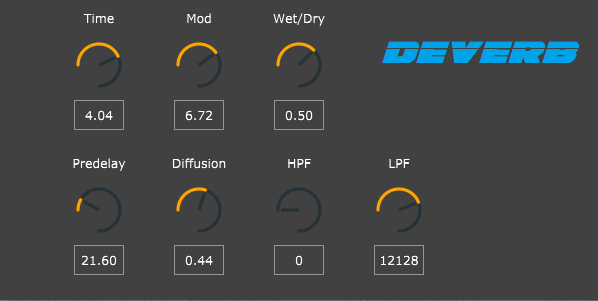

# Deverb
My go at creating a reverb plugin using the JUCE framework.

I wanted to create a reverb algorithm simliar in sound to that of the  Alesis rack units from the 80's and 90's: dark, gritty, and lo-fi, a characteristic rare in modern reverb plugins.
The algorithm was based on [this](https://www.kvraudio.com/forum/viewtopic.php?t=349039#top) reverb topology I found on a kvraudio site thread which also contained some great insight from Sean Costello, of ValhallaDSP, on the kinds of algorithms that might have been found on those old alesis boxes.

The completed plugin build is in the VST3 folder.